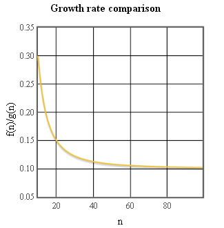
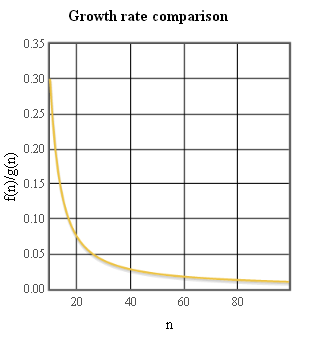
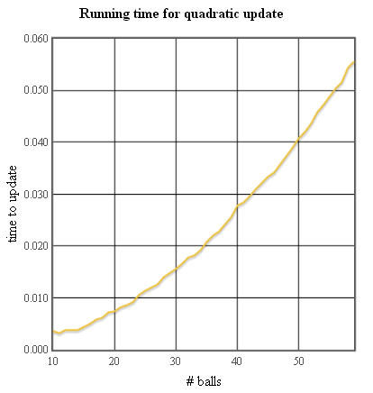
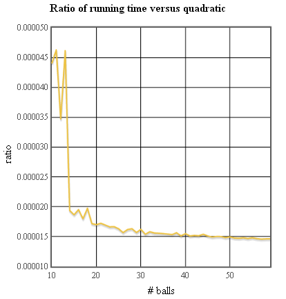
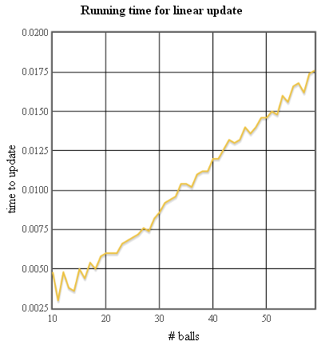
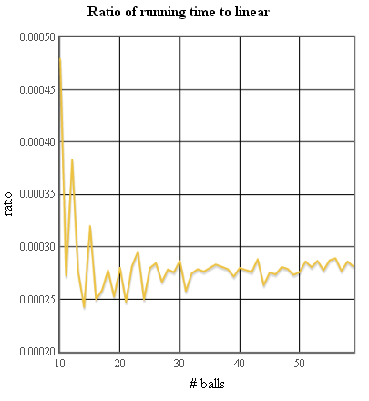

#[Growth Rates of Functions](https://www.coursera.org/learn/principles-of-computing-1/supplement/HqPUS/practice-activity-modeling-the-growth-of-functions)

As part of this class, we will model the growth rates of certain quantities associated with a program, such as the number of statements in its execution trace, its running time, or the size of its computed output. In these cases, our goal will be to determine a function f(n) that models the growth of this quantity as a function of the input size n to the program. As part of the analysis, we will often wish to compare the growth rate of this function to various known functions to better understand the behavior of the program.

Given two function f(n) and g(n), these functions grow at the same rate if the ratio f(n)/g(n) approaches some fixed constant as n grows large. If this ratio approaches zero as n grows large, f(n) grows more slowly than g(n). On the other hand, if this ratio approaches infinity, f(n) grows faster than g(n). For this class, we won't focus too much effort on doing a formal mathematical analysis of growth rates. Instead, we will learn a few simple mathematical rules for comparing the growth rates of various functions and rely on techniques such as plotting when these rules aren't sufficient for our analysis.

Note that in our comparison of functions, we consider functions that are constant multiples of each other to be "equivalent". This choice reflects the fact that we are more concerned with the growth in the size of a quantity than the actual value of the quantity. For example, the running time of a program may depend on many factors such as the power of computer's processor, the speed of its operating system, and the performance of any environment that runs the computation (like a web browser). However, if the running time of a program grows at an exponential rate, the processing power of even the fastest computers will be quickly overwhelmed.

#### Techniques for comparing growth rates

In practice, comparing the growth rates of the functions that we will encounter in this class is relatively easy. Here are some simple rules that you should remember:

+ Two polynomial functions f(n) and g(n) grow at the same rate if they have the same degree. Lower degree terms in these functions have no effect on the relative growth rates.

+ If the degree of a polynomial function f(n) is higher than the degree of g(n), f(n) grows faster than g(n). Conversely, if the degree of f(n) is lower, f(n) grows slower than g(n).

+ The function log(n) grows faster than the constant function 1 and slower than the linear function n. The function n*log(n) grows faster than n and slower than n2.

+ Any exponential function αn with α>1 grows faster than any polynomial function. The factorial function n! grows faster than αn and, consequently, faster than any polynomial function.

One simple visual technique for comparing the growth rates of pairs of functions is to plot f(n)/g(n) for a reasonable range of values for n. Examining the resulting plots usually provides some insight into the relative growth rates of the functions being compared. For example, the three plots created by [this program](http://www.codeskulptor.org/#poc_growth_plot.py) illustrate the situation when f(n) is 0.1n3+20n while g(n) are the functions n3, 20n2, and 0.1n4, respectively. Note that the leftmost plot tends toward a positive constant value (a horizontal line), the middle plot increases continuously and has no upper bound, and the right plot converges towards zero. These plots reflect the fact that two cubics grow at the same rate, a cubic grows faster than a quadratic, and a cubic grows slower than a quartic.

 

 

#### An example from ball physics

Games like Pong involve a ball bouncing around a closed domain. One interesting generalization of this situation is to allow several balls that bounce off of each other as well as the walls of the domain. This program allows the user to click in the canvas to spawn new balls, and displays the frame rate (number of draws per second) of the resulting simulation. As the number of balls increases, the time taken to compute all ball/ball collisions during each physics update in the simulation increases and the frame rate of the simulation begins to slow.

Since each one of the n balls is tested for collision against every other ball during the physics update, the total number of ball/ball collisions is approximately 12n2. (The factor of 12 arises because each pair of balls is tested for collision only once.) The left plot below shows an estimate of the time taken to compute all 12n2 of these collisions during a single update. Observe that this function has a parabolic shape and appears to be growing quadratically. (All times are computed on an ancient desktop so don't worry about the absolute scale.) The right plot shows the ratio of the running times and the function n2. Observe that the plot is trending towards a positive constant which confirms our analysis that the running time for this update method is growing quadratically.

 

One method for accelerating this physics update is to divide the canvas into a grid whose cells are roughly the size of the balls. Before computing ball/ball collisions during a physics update, each ball is assigned to the cell that contains the center of the ball. Since the size of the grid cells are the diameter of the ball, a maximum of four balls can be assigned to any one cell. Then, during the collision phase, a ball is tested against only those balls in its own cell and its eight spatially-adjacent neighbors. This limits the total number of balls that needs to be tested for collision to be less than or equal to 4×9=36 balls. Overall, a maximum of 36n total collision tests are done during each update.

This program implements this alternative algorithm for performing physics updates. The left plot below shows the time per update plotted as a function of the number of balls. Observe that the running time for each update appears to grow linearly as a function of the number of balls. The right plot shows the ratio of the running times and the function n. Observe that the plot is trending towards a positive constant which confirms our analysis that the running time for this update method is growing linearly.

 

This example illustrates the importance of algorithms and our analysis of their efficiency. At first glance, our original method seemed simple and efficient. However, we note that the added complexity of our improved collision method is well worth the effort since the enhanced speed of the update method allows us to add many more balls to our simulation.
