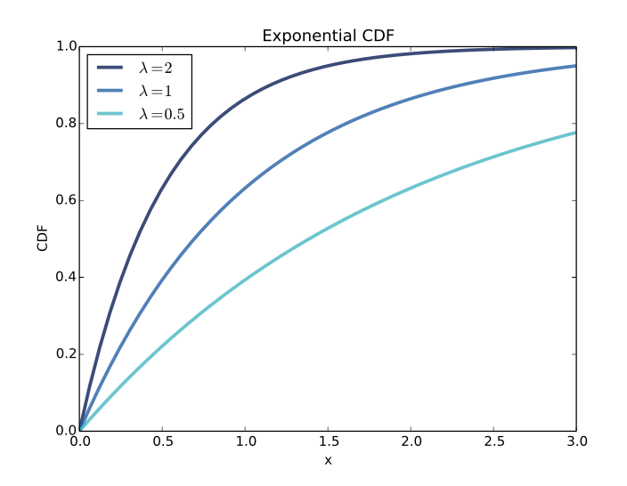
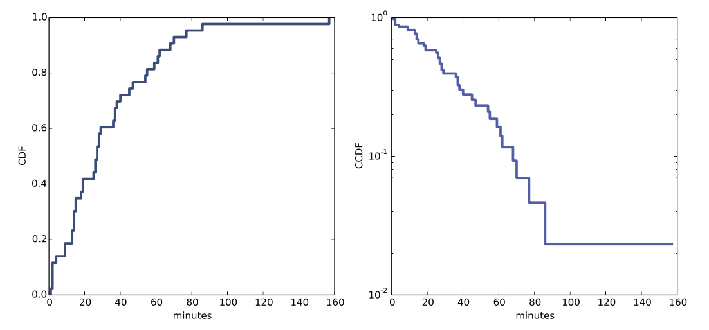

# Think Stats by Allen Downey
Think Stats is an 'interactive' book, if you will, by virtue of using Jupyter Notebooks.  It also includes a lot of code modules that are used throughout the book which Downey wrote just for this purpose.  So, using them is advisable when going through the book.  In my opinion, they are written at a high enough level to actually use anytime in dealing with distributions and stats -- just `import thinkstats2 as ts2` in the correct directory (or simply put the module somewhere and add to PYTHONPATH).

Many passages below are directly from the book and were simply things I enjoyed or wanted to save.


## Empirical Distributions

### 2. Histograms
Counts up items in a list / series / sample and tells you how many times they appear, or their _frequency_.  Helps reveal the distribution of the data.  

In python, one easy way to think about histograms is as a dictionary with occurrences / sample possibilities as the _keys_ and their counts as _values_.

```python
# randomly selection IQs from 10,000 people.  Make into 20 bins.
hist, edges = np.histogram(np.random.normal(100, 15, 10000), bins=np.arange(35, 65, 5))

# create dict with IQ scores as keys and frequency/count as values
histo_dict = {k: v for k, v in zip(edges.astype(int), hist)}

# Output
{35: 0,
 40: 1,
 45: 1,
 50: 6,
 55: 24,
 60: 61,
 65: 115,
 70: 264,
 75: 427,
 80: 678,
 85: 897,
 90: 1234,
 95: 1321,
 100: 1292,
 105: 1146,
 110: 898,
 115: 678,
 120: 489,
 125: 259,
 130: 127,
 135: 46,
 140: 25,
 145: 9,
 150: 2,
 155: 0}
```

These are the raw counts for how many people out of 1,000 scored a given result on an IQ exam.  Considering the data was made by sampling randomly from a normal distribution, we expect the data to be normally distributed (especially at a sample size = 1,000).  This is nice as a cursory inspection, but it can be misleading if we compare two histograms of distinctly differently-sized populations.  Below we will see how to normalize the distribution so that we can compare _probabilities_ instead of _frequencies_, thus obviating sample size issues.

Note this is technically a _binned_ distribution because there are some scores not reported, such as 102, which someone surely did score.  Instead it represents the range between the two numbers, inclusive of the lower value and up to but not including the upper value (e.g. 35-39, 40-44, etc.).


#### Effect size
An effect size is a summary statistic intended to describe (wait for it) the size of an effect. For example, to describe the difference between two groups, one obvious choice is the difference in the means.  

Mean pregnancy length for first babies is 38.601; for other babies it is 38.523. The difference is 0.078 weeks, which works out to 13 hours. As a fraction of the typical pregnancy length, this difference is about 0.2%.  

If we assume this estimate is accurate, such a difference would have no practical consequences. In fact, without observing a large number of pregnancies, it is unlikely that anyone would notice this difference at all.

Another way to convey the size of the effect is to compare the difference between groups to the variability within groups. Cohen’s $d$ is a statistic intended to do that; it is defined

$$
d = \frac{x_1 − x_2} s  
$$

where $x_1$ and $x_2$ are the means of the groups and $s$ is the “pooled standard deviation.”

Here’s the Python code that computes Cohen’s $d$:

```python
def CohenEffectSize(group1, group2):
    diff = group1.mean() - group2.mean()
    var1 = group1.var()
    var2 = group2.var()
    n1, n2 = len(group1), len(group2)
    pooled_var = (n1 * var1 + n2 * var2) / (n1 + n2)
    d = diff / math.sqrt(pooled_var)
    return d
```

In this example, the difference in means is 0.029 standard deviations, which is small. To put that in perspective, the difference in height between men and women is about 1.7 standard deviations (see https://en.wikipedia.org/wiki/Effect_size).


<BR><BR>

### 3. Probability Mass Function - PMF

#### PMFs
Another way to represent a distribution is a probability mass function (PMF), which maps from each value to its _probability_. A probability is a frequency expressed as a fraction of the sample size, $n$. To get from frequencies to probabilities, we divide through by $n$, which is called _normalization_.


Using the `histo_dict` from above, we can convert the frequencies of the histogram data to the probabilities of a PMF by dividing the raw count value by the total number of observations.  In this case, the total number of samples/observations was 1,000, which means the probability is found simply by moving the decimal four spots over.  However, that is usually not the case, so we will do the math quickly in a list and dict comp.

```python
probs = [val / sum(histo_dict.values()) for val in histo_dict.values()]
pmf_dict = {k: p for k, p in zip(histo_dict.keys(), probs)}

# output
{35: 0.0,
 40: 0.0001,
 45: 0.0001,
 50: 0.0006,
 55: 0.0024,
 60: 0.0061,
 65: 0.0115,
 70: 0.0264,
 75: 0.0427,
 80: 0.0678,
 85: 0.0897,
 90: 0.1234,
 95: 0.1321,
 100: 0.1292,
 105: 0.1146,
 110: 0.0898,
 115: 0.0678,
 120: 0.0489,
 125: 0.0259,
 130: 0.0127,
 135: 0.0046,
 140: 0.0025,
 145: 0.0009,
 150: 0.0002,
 155: 0.0}
```

Again, this PMF has been binned because the histogram data it was built from was binned.  This is a common occurrence in using PMFs, but there is an 'art' to it as using too many bins doesn't 'capture' the data's trends well but too few bins loses information.  One way around this is to use a CMF, discussed below.


Or we can also use the nice built in methods and objects from the `thinkstats2` module that accompanies this book.  Given a Hist object from `thinkstats2`, we can make a dictionary that maps from each value to its probability:
```python
n = hist.Total()
d = {}
for x, freq in hist.Items():
d[x] = freq / n
```

Or we can use the Pmf class provided by thinkstats2. Like Hist, the Pmf constructor can take a list, pandas Series, dictionary, Hist, or another Pmf object. Here’s an example with a simple list:

```bash
>>> import thinkstats2
>>> pmf = thinkstats2.Pmf([1, 2, 2, 3, 5])
>>> pmf

Pmf({1: 0.2, 2: 0.4, 3: 0.2, 5: 0.2})
```

The Pmf is normalized so total probability is 1.
Pmf and Hist objects are similar in many ways; in fact, they inherit many of their methods from a common parent class. For example, the methods Values and Items work the same way for both. The biggest difference is that _a Hist maps from values to integer counters; a Pmf maps from values to floating-point probabilities._

Note that modifying a probability within a PMF will result in a cumulative probability of the PMF not adding up to 1 (which makes the conclusions drawn from a PMF useless).  In order to fix this we must re-normalize (divide through by the total probability to make it 1 again) the PMF before we can use it again.  Intuitively, if we drop the probability for one item, the probabilities for the remaining items in the PMF will increase and vice versa.

If you are given a PMF, you can still compute the mean, but the process is slightly different:
$$
\overline{x} = \sum_{i} p_i \times x_i
$$

where the $x_i$ are the unique values in the PMF and $p_i = PMF(x_i)$. Similarly, you can compute variance like this:
$$
S^2 = \sum_{i} p_i (x_i − \overline{x})^2
$$

The reason a PMF is valuable is that it allows to use cut through differing sample sizes and compare simple probabilities.  They also allow the flexibility to bias or unbias a distribution.  Below is an example of taking in a PMF of marathon runners' speeds and choosing a given speed that someone might run at and seeing how the other runners appear to someone running that speed (e.g. the distribution will shift based on how fast you run since you will pass/be passed at different rates).

```python
def ObservedPmf(pmf, speed, label=None):
    """Returns a new Pmf representing speeds observed at a given speed.

    The chance of observing a runner is proportional to the difference
    in speed.

    Args:
        pmf: distribution of actual speeds
        speed: speed of the observing runner
        label: string label for the new dist

    Returns:
        Pmf object
    """
    new = pmf.Copy(label=label)
    for val in new.Values():
        diff = abs(val - speed)
        new[val] *= diff
    new.Normalize()
    return new
```


#### Chapter 3 Glossary
+ __Probability mass function (PMF)__:  
    A representation of a distribution as a function that maps from values to probabilities.

+ __Probability__:  
    A frequency expressed as a fraction of the sample size.

+ __Normalization__:  
    The process of dividing a frequency by a sample size to get a probability.


<BR><BR>

### 4. Cumulative Distribution Function - CDF

### Percentiles
If you have taken a standardized test, you probably got your results in the form of a raw score and a _percentile rank_. In this context, the percentile rank is the fraction of people who scored lower than you (or the same). So if you are “in the 90th percentile,” you did as well as or better than 90% of the people who took the exam.

Here’s how you could compute the percentile rank of a value, `your_score`, relative to the values in the sequence scores:

```python
def PercentileRank(scores, your_score):
    count = 0
    for score in scores:
        if score <= your_score:
            count += 1

    percentile_rank = 100.0 * count / len(scores)
    return percentile_rank
```
As an example, if the scores in the sequence were 55, 66, 77, 88 and 99, and you got the 88, then your percentile rank would be 100 * 4 / 5 which is 80.

If you are given a value, it is easy to find its _percentile rank_; going the other way is slightly harder. If you are given a percentile rank and you want to find the corresponding value, one option is to sort the values and search for the one you want:

```python
def Percentile(scores, percentile_rank):
    scores.sort()
    for score in scores:
        if PercentileRank(scores, score) >= percentile_rank:
            return score
```

The result of this calculation is a _percentile_. For example, the 50th percentile is the value with percentile rank = 50. In the distribution of exam scores above, the 50th percentile is 77.  This implementation of `Percentile` is not efficient. A better approach is to use the percentile rank to compute the index of the corresponding percentile:

```python
def Percentile2(scores, percentile_rank):
    scores.sort()
    index = percentile_rank * (len(scores)-1) // 100
    return scores[index]
```

The difference between “percentile” and “percentile rank” can be confusing, and people do not always use the terms precisely. To summarize, `PercentileRank` takes a value and computes its percentile rank in a set of values; `Percentile` takes a percentile rank and computes the corresponding value.


### CDF
The CDF is the function that maps from a _value_ to its _percentile rank_.
The CDF is a function of $x$, where $x$ is any value that might appear in the distribution. To evaluate $CDF(x)$ for a particular value of $x$, we compute the fraction of values in the distribution less than or equal to $x$.

Here’s what that looks like as a function that takes a sequence, `sample`, and a value, `x`:

```python
def EvalCdf(sample, x):
    count = 0.0
    for value in sample:
        if value <= x:
            count += 1
    prob = count / len(sample)
    return prob
```

This function is almost identical to `PercentileRank`, except that the result is a probability in the range 0–1 rather than a percentile rank in the range 0–100.


As an example, suppose we collect a sample with the values `[1, 2, 2, 3, 5]`. Here are some values from its CDF:  

__CDF(0) = 0__  
CDF(1) = 0.2  
CDF(2) = 0.6  
CDF(3) = 0.8  
__CDF(4) = 0.8__  
CDF(5) = 1

Note the two bold items, 0 and 4.  We can evaluate the CDF for any value of $x$, not just values that appear in the sample. If $x$ is less than the smallest value in the sample, $CDF(x)$ is 0.  If it's greater than the largest value, $CDF(x)$ is 1.  Since the increments are discrete, a CDF is what's known as a _step function_.


The CDF is approximately a straight diagonal line, which means that the distribution is uniform. That outcome might be non-obvious, but it is a consequence of the way the CDF is defined. What this figure shows is that 10% of the sample is below the 10th percentile, 20% is below the 20th percentile, and so on, exactly as we should expect.

The biggest advantage offered by CDFs and percentile ranks is their comparative transferability.  We can convert the value or result in one sample or field to a percentile rank and then find the same rank in a different group (that is applicable) for a cross-group comparison.  For example, we can convert the raw IQ score of an eight-year-old child to the corresponding percentile rank amongst his age group and then find the value that equals the same percentile rank for adults.  This allows us to determine how well a child did compared to an adult, etc.

#### Chapter 4 Glossary
+ __percentile rank__:  
    The percentage of values in a distribution that are less than or equal to a given value.

+ __percentile__:  
    The value associated with a given percentile rank.

+ __cumulative distribution function (CDF)__:  
    A function that maps from values to their cumulative probabilities. $CDF(x)$ is the fraction of the sample less than or equal to $x$.

+ __inverse CDF__:  
    A function that maps from a cumulative probability, $p$, to the corresponding value.

+ __median__:  
The 50th percentile, often used as a measure of central tendency.

+ __interquartile range__:  
The difference between the 75th and 25th percentiles, used as a measure of spread.

+ __quantile__:  
A sequence of values that correspond to equally spaced percentile ranks; for example, the quartiles of a distribution are the 25th, 50th and 75th percentiles.

+ __replacement__:  
A property of a sampling process. “With replacement” means that the same value can be chosen more than once; “without replacement” means that once a value is chosen, it is removed from the population.


## Analytic Distributions
The distributions we have used so far are called _empirical distributions_ because they are based on empirical observations, which are necessarily finite samples.

The alternative is an _analytic distribution_, which is characterized by a CDF that is a mathematical function. Analytic distributions can be used to model empirical distributions. In this context, a model is a simplification that leaves out unneeded details. This chapter presents common analytic distributions and uses them to model data from a variety of sources.

### Exponential Distribution

$$
CDF(x) = 1 − e^{−λx}
$$

The parameter, $λ$, determines the shape of the distribution. Below we see what this CDF looks like with $λ =$ 0.5, 1, and 2.



In the real world, exponential distributions come up when we look at a series of events and measure the times between events, called _inter-arrival times_. If the events are equally likely to occur at any time, the distribution of inter-arrival times tends to look like an exponential distribution.

One real-world example is the time between births.  Looking at the this inter-arrival time for 44 births from the database, we can look at the CDF and its cousin the _complementary CDF (CCDF)_ to see if the data is from an exponential distribution.  A CCDF is simply $1 - CDF(x)$.  If the sampling distribution is from an exponential distribution, the CCDF will be a straight line _if plotted on a log-y scale._

This works because if you plot a CCDF of a dataset that you think is from an exponential distribution, we expect something along the lines of:

$$
y \approx e^{-\lambda x}
$$

Taking the log of both sides:
$$
\log y \approx -\lambda x
$$

So on a log-y scale the CCDF is a straight line with slope $−λ$



CDF on the left, CCDF with log-y scale on the right.  It is not exactly straight, which indicates that the exponential distribution is not a perfect model for this data. Most likely the underlying assumption —- that a birth is equally likely at any time of day —- is not exactly true. Nevertheless, it might be reasonable to model this dataset with an exponential distribution. With that simplification, we can summarize the distribution with a single parameter.

The parameter, $λ$, can be interpreted as a rate; that is, the number of events that occur, on average, in a unit of time. In this example, 44 babies are born in 24 hours, so the rate is $λ = 0.0306$ births per minute. The mean of an exponential distribution is $\frac{1}λ$, so the mean time between births is 32.7 minutes.


### Normal Distribution
The normal distribution, also called _Gaussian_, is commonly used because it describes many phenomena, at least approximately. It turns out that there is a good reason for its ubiquity, which we will get to in Section 14.4.

The normal distribution is characterized by two parameters: the mean, $μ$, and standard deviation $σ$. The normal distribution with $μ = 0$ and $σ = 1$ is called the _standard normal distribution_. Its CDF is defined by an integral that does not have a closed form solution, but there are algorithms that evaluate it efficiently. One of them is provided by SciPy: `scipy.stats.norm` is an object that represents a normal distribution; it provides a method, `cdf`, that evaluates the standard normal CDF.


##### Checking for Normality
Matching the CDF of a normal distribution with best-fit parameters to a CDF of real data, such as birth weights or inter-arrival times, is one way to determine if a normal distribution would serve as a good model for the data.  Another way is to use a _probability plot_.  

#### Probability Plot
Here's the "easy" way to make a probability plot.
1. Sort the values in the sample.  
2. From a standard normal distribution (\$μ = 0\$ and \$σ = 1\$), generate a random sample with the same size as the sample, and sort it.  
3. Plot the sorted values from the sample versus the random values.
